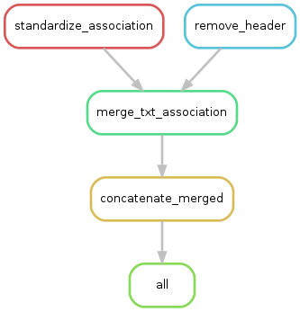

A [Snakemake](https://bitbucket.org/johanneskoester/snakemake/wiki/Home) pipeline to process the GOElite files.

This requires [Python 3](https://www.python.org/downloads/release/python-343/).

1. Copy (or symlink) GO Elite files into the `input` directory.
2. Use `snakemake` to run.

This pipeline:

1. Standardizes the column names of the association files and remove header lines from text files.
2. Merge the text and association files.
3. Concatenates the merged files.

